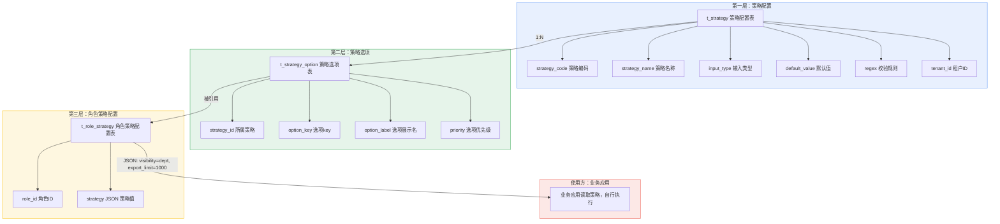
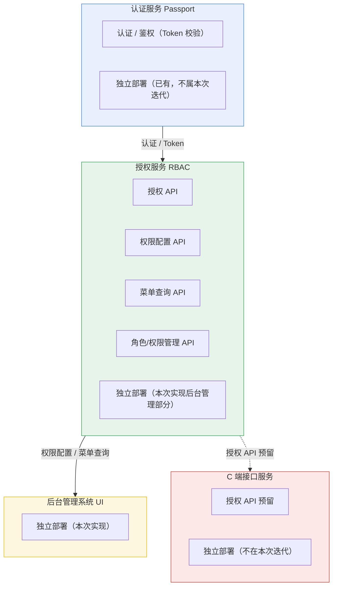

# TRD2：权限管理系统

# TRD：权限管理系统

产品需求规格说明书（TRD） 

2022年10⽉27⽇ 需求发起⼈：项目发起人 产品经理：产品经理姓名

# ⼀\. ⽅案概述 

## 1\.1 背景介绍 

认证授权作为平台系统的底层平台，任何系统和业务都需要后台的权限控制，梳理出通用的权限业务，减少每条业务线重复开发，为企业降本增效，在这样的背景下，我们研发权限管理平台。助力上游业务迭代。 

## 1\.2 价值  

架构价值 

我们从架构层面抽离通用权限模块，为上游应用提供服务，上游应用只关注业务即可，不必重复投入研发。降本增效。 

## 1\.3 最终⽬标 

### 解决核心痛点：

为上游应用提供通用的权限控制，支持不同APP 和微服务的权限控制和隔离！支持跨多租户的权限控制，所以每个业务表都需要加租户字段

> **本次迭代范围：仅实现后台管理系统部分，包括权限配置、菜单管理、角色管理、权限分配、用户\-角色分配。**
> 
> **业务授权接口、角色互斥不在本次迭代范围内，后续按需迭代。**
> 
> 


|模块|内容|scope|部署|备注|
|---|---|---|---|---|
|后台管理系统|权限配置 UI、菜单管理、角色管理、权限分配、用户\-角色分配|实现<br>|独立部署<br>||
|授权服务（后台管理部分）|权限配置 API、菜单查询 API、角色/权限管理 API||||
|后台用户体系|t\_admin\_user、后台角色、后台用户\-角色||||
|多租户|所有表带 tenant\_id，后台管理支持多租户隔离||||
|权限模型|t\_permission、t\_role、t\_permission\_assignments、t\_user\_role  t\_organization t\_position t\_user\_group ||||
|审计|关键操作审计日志||||
|C 端接口服务|单独维护、单独部署|不实现|独立部署<br>|后续迭代|
|C 端授权接口|C 端按需接入|||后续按需|
|数据权限|MyBatis 拦截器||—|预留|
|角色互斥|需求明确暂不考虑||—||

## 1\.4 相关系统TRD 

租户信息在token 中生成，租户维护在认证服务中。具体方案见：[认证方案](https://sparrowzoo.feishu.cn/docx/Vo7CdhofQoejxsxmq6vcwYhNnMg)

## 1\.5 术语和缩略语 

### NIST RBAC 

是美国国家标准与技术研究院（NIST）主导制定的基于角色的访问控制国家标准，全称是 ANSI INCITS 359\-2004（后续有 2012 版及重申版本）。

它是 RBAC 领域最具权威性的标准化模型，统一了此前学术界和工业界分散的 RBAC 定义。

### 📜 它的由来

RBAC 概念最早由 NIST 的 David Ferraiolo 和 Rick Kuhn 在 1992 年正式提出。2000 年，NIST 联合 George Mason 大学的 Ravi Sandhu 等人，将早期模型与 Sandhu 的框架整合，形成了统一的 NIST RBAC 模型提案。该提案经 INCITS（国际信息技术标准委员会）审议后，于 2004 年正式成为美国国家标准

### RBAC

基于角色的访问控制（RBAC）是实施面向企业安全策略的一种有效的访问控制方式。Role\-Based Access Control 的缩写。

### APP

单独运营的应用，包括企业级的通用应用如ERP CRM 财务等系统，也包括微服务电商等大型应用。

### 微服务

大型分布式系统中的一个子系统，独立部署，跨团队协作研发。

### 用户：

RBAC 基于admin 用户构建，与passport 用户严格隔离，但用户是passport 用户的子集。ID共享复用，因为全局统一。具体见下文。文中涉及的user\_id 都是passport中的user\_id\. admin\_user\_id,只作为唯一自增主键，不被引用。admin\_user相关的字段以passport 为准，这里不再冗余配置。

### Permission（权限）

NIST RBAC 标准定义的模型实体，建模为 `operation × object` 二元组：

- operation：操作，如 create、read、update、delete、export、view。

- object：对象/资源域，如 order、user、report、menu。

一个 permission 表示“对某个对象执行某个操作”，如 `order:create`。
它是原子、可枚举、可分配、可存储的，落地为物理表 `permission_item`。

### Privilege（特权/权限集合）

不是 NIST RBAC 的标准实体，标准中只出现在原则名 `least privilege`（最小特权）中。
它表示角色全部 permission 并集在运行时的效果，即“因此你实际能做什么”。

- 是聚合、派生、不可直接分配的。

- 随底层 permission 变化自动同步。

- 是实时计算出来的，可以理解为视图 （不存在实际的物理表）

# ⼆、系统需求  

1. 支持APP 和微服务的权限隔离，支持资讯的版块\(大纲\)授权。

2. **用户多角色权限取并集,策略相同时，按优先级取最大  见角色优先级设计**

3. **前后端分离和前后端不分离,菜单处理\.**

4. 数据权限（mybatis 拦截器维护）

5. Casbin 调研

# 三、总体⽅案 

## 3\.1 全景架构图

部门是组织，组织决定策略范围，组是权限，组决定权限范围 两者职责分离

- 支持虚拟用户群组，可能跨部门 可以给用户组加角色 同组下的用户有相同的权限

- 部门只有一个，岗位可以有多个\(岗位包含所属部门\)

- 资源必须有一个微服务（单体应用本身即为微服务）

- 用户角色表，不要冗余APPID 因为角色的APP ID可以修改

## 3\.2 内部模块依赖图

## 3\.3\. 核心业务流程图及类图

### 3\.3\.1 APP 申请分配

### 3\.3\.2 系统默认数据配置

配置全局的默认数据

### 3\.3\.3 角色权限分配

配置app 内部的权限

## 3\.4 权限接口服务

### 后台应用

- 根据用户id 获取app 列表

- 根据用户id\+app id 实现菜单渲染

### 前台服务接口

考虑缓存及权限变动时的数据一致性问题！避免延迟双删策略，可以考虑业务上操作的时间间隔控制，提示操作频繁，请稍后再试！

- 根据用户id、应用id和authority判断有没有对应资源权限

- 根据用户id、应用id和策略key返回策略值

- 根据用户id、应用id获取角色

- 为后台提供缓存删除接口

- 提供一致性检测接口

# 四、系统依赖 

4\.1、 认证服务

# 五、⻛险 

# 六、运⾏设计 

## 6\.1 数据库设计

### 通用字段

```SQL
`create_user_id` bigint UNSIGNED NOT NULL DEFAULT 0 COMMENT '创建人ID',
 `gmt_create` bigint UNSIGNED NOT NULL DEFAULT 0 COMMENT '创建时间',
 `modified_user_id` bigint UNSIGNED NOT NULL DEFAULT 0 COMMENT '更新人ID',
 `gmt_modified` bigint UNSIGNED NOT NULL DEFAULT 0 COMMENT '更新时间',
 `create_user_name` varchar(64) NOT NULL DEFAULT '' COMMENT '创建人',
 `modified_user_name` varchar(64) NOT NULL DEFAULT '' COMMENT '更新人',
 `deleted` tinyint(1) NOT NULL DEFAULT 0 COMMENT '逻辑删除：0=未删除 1=已删除',
 `status` tinyint(1) NOT NULL DEFAULT 1 COMMENT '状态：1=启用 0=禁用'

```


### 6\.1\.1 APP

```SQL
CREATE TABLE `t_app` (
  `id` bigint UNSIGNED NOT NULL AUTO_INCREMENT COMMENT '主键',
  `tenant_id` bigint UNSIGNED NOT NULL DEFAULT 0 COMMENT '租户ID，0=全局，>0=租户私有',
  `code` varchar(32) NOT NULL DEFAULT '' COMMENT '应用编码',
  `name` varchar(32) NOT NULL DEFAULT '' COMMENT '应用名称',
  `sort` int NOT NULL DEFAULT 0 COMMENT '排序',
  `logo` varchar(256) NOT NULL DEFAULT '' COMMENT '应用logo',
  `remark` varchar(512) NOT NULL DEFAULT '' COMMENT '备注',
  `status` tinyint(1) NOT NULL DEFAULT 1 COMMENT '状态：1=启用 0=禁用',
  `create_user_id` bigint UNSIGNED NOT NULL DEFAULT 0 COMMENT '创建人ID',
  `gmt_create` bigint UNSIGNED NOT NULL DEFAULT 0 COMMENT '创建时间',
  `modified_user_id` bigint UNSIGNED NOT NULL DEFAULT 0 COMMENT '更新人ID',
  `gmt_modified` bigint UNSIGNED NOT NULL DEFAULT 0 COMMENT '更新时间',
  `create_user_name` varchar(64) NOT NULL DEFAULT '' COMMENT '创建人',
  `modified_user_name` varchar(64) NOT NULL DEFAULT '' COMMENT '更新人',
  `deleted` tinyint(1) NOT NULL DEFAULT 0 COMMENT '逻辑删除：0=未删除 1=已删除',
  PRIMARY KEY (`id`),
  UNIQUE KEY `uk_tenant_code` (`tenant_id`, `code`),
  KEY `idx_status` (`status`)
) ENGINE=InnoDB DEFAULT CHARSET=utf8mb4 COMMENT='应用表'

```

### 6\.1\.2 微服务

```SQL
1. 域名route goods.admin.tedu.life/goods-manage
            stock.admin.tedu.life/stock-manage
            网关和微服务拿到相同的path
2. Path route admin.tedu.life/goods/goods-manage
            网关path /goods/goods-manage
            微服务path /goods-manage 不同 权限中存微服务path goods-manage

            给前端返回 goods-manage 前端无法路由跳转，需要添加对应微服务的path拼接

CREATE TABLE `t_micro_service` (
  `id` bigint UNSIGNED NOT NULL AUTO_INCREMENT COMMENT '主键',
  `tenant_id` bigint UNSIGNED NOT NULL DEFAULT 0 COMMENT '租户ID，0=全局，>0=租户私有',
  `app_id` bigint UNSIGNED NOT NULL DEFAULT 0 COMMENT '所属应用ID',
  `code` varchar(32) NOT NULL DEFAULT '' COMMENT '微服务编码',
  `name` varchar(32) NOT NULL DEFAULT '' COMMENT '微服务名称',
  `url` varchar(256) NOT NULL DEFAULT '' COMMENT '微服务地址，域名路由为域名，path路由为域名/path',
  `sort` int NOT NULL DEFAULT 0 COMMENT '排序',
  `logo` varchar(256) NOT NULL DEFAULT '' COMMENT '微服务logo',
  `status` tinyint(1) NOT NULL DEFAULT 1 COMMENT '状态：1=启用 0=禁用',
  `remark` varchar(512) NOT NULL DEFAULT '' COMMENT '备注',
  `create_user_id` bigint UNSIGNED NOT NULL DEFAULT 0 COMMENT '创建人ID',
  `gmt_create` bigint UNSIGNED NOT NULL DEFAULT 0 COMMENT '创建时间',
  `modified_user_id` bigint UNSIGNED NOT NULL DEFAULT 0 COMMENT '更新人ID',
  `gmt_modified` bigint UNSIGNED NOT NULL DEFAULT 0 COMMENT '更新时间',
  `create_user_name` varchar(64) NOT NULL DEFAULT '' COMMENT '创建人',
  `modified_user_name` varchar(64) NOT NULL DEFAULT '' COMMENT '更新人',
  `deleted` tinyint(1) NOT NULL DEFAULT 0 COMMENT '逻辑删除：0=未删除 1=已删除',
  PRIMARY KEY (`id`),
  UNIQUE KEY `uk_app_code` (`app_id`, `tenant_id`, `code`),
  KEY `idx_app_id` (`app_id`)
) ENGINE=InnoDB DEFAULT CHARSET=utf8mb4 COMMENT='微服务表'
# 如果是域名路由 url 就是域名
# 如果是path路由 url 就是域名/path固定

```

### 6\.1\.3  permission 表 （许可）

该表设计与菜单表一起维护，统一管理，方便维护。

菜单变更仅刷新前端路由缓存，不触发后端鉴权缓存失效。


```SQL
CREATE TABLE `t_permission` (
  `id` bigint UNSIGNED NOT NULL AUTO_INCREMENT COMMENT '主键',
  `tenant_id` bigint UNSIGNED NOT NULL DEFAULT 0 COMMENT '租户ID，0=全局，>0=租户私有',
  `permission_code` varchar(128) NOT NULL COMMENT '权限编码，如 menu:order:view 或 order:create',
  `permission_name` varchar(64) NOT NULL COMMENT '权限/菜单名称',
  `permission_type` tinyint NOT NULL DEFAULT 1 COMMENT '类型：1菜单 2页面 3按钮 4API 5事件',
  `micro_service_id` bigint UNSIGNED NOT NULL DEFAULT 0 COMMENT '所属微服务ID',
  `parent_id` bigint UNSIGNED NOT NULL DEFAULT 0 COMMENT '父节点ID，菜单树用，0=根',
  `operation` varchar(64) NOT NULL DEFAULT '' COMMENT '操作，view/create/update/delete/export…',
  `object` varchar(64) NOT NULL DEFAULT '' COMMENT '对象/资源域，order/user/report…',
  `url` varchar(256) NOT NULL DEFAULT '' COMMENT '菜单/页面跳转地址',
  `method` varchar(8) NOT NULL DEFAULT '' COMMENT 'HTTP方法，API用',
  `icon` varchar(256) NOT NULL DEFAULT '' COMMENT '菜单图标',
  `open_type` varchar(16) NOT NULL DEFAULT '' COMMENT '打开方式 _blank/_self',
  `sort` int NOT NULL DEFAULT 0 COMMENT '排序',
  `status` tinyint(1) NOT NULL DEFAULT 1 COMMENT '状态：1=启用 0=禁用',
  `create_user_id` bigint UNSIGNED NOT NULL DEFAULT 0 COMMENT '创建人ID',
  `gmt_create` bigint UNSIGNED NOT NULL DEFAULT 0 COMMENT '创建时间',
  `modified_user_id` bigint UNSIGNED NOT NULL DEFAULT 0 COMMENT '更新人ID',
  `gmt_modified` bigint UNSIGNED NOT NULL DEFAULT 0 COMMENT '更新时间',
  `create_user_name` varchar(64) NOT NULL DEFAULT '' COMMENT '创建人',
  `modified_user_name` varchar(64) NOT NULL DEFAULT '' COMMENT '更新人',
  `deleted` tinyint(1) NOT NULL DEFAULT 0 COMMENT '逻辑删除：0=未删除 1=已删除',
  PRIMARY KEY (`id`),
  UNIQUE KEY `uk_tenant_ms_code` (`tenant_id`, `micro_service_id`, `permission_code`),
  KEY `idx_ms_type_status` (`micro_service_id`, `permission_type`, `status`),
  KEY `idx_parent` (`parent_id`),
  KEY `idx_object` (`object`)
) ENGINE=InnoDB DEFAULT CHARSET=utf8mb4 COMMENT='权限/菜单/资源表'

```

### 6\.1\.4 角色

策略优先级:当用户拥有多个角色，且不同角色对同一策略配置了不同值时，需要优先级决定哪个生效。

```Plain Text
用户 A 拥有角色：管理员、普通员工
管理员：可见范围 = 全部
普通员工：可见范围 = 本人
用户 A 实际可见范围 = ? → 按角色优先级取最高的角色配置

1. 收集用户所有角色的策略
2. KEY 不同 → 取并集
3. KEY 相同 → 按 option.priority 取最大
4. option.priority 相同 → 按 role.priority 取最大
5. 都没有 → 用 defaultValue
```

```SQL
-- 角色优先级：当用户拥有多个角色，且不同角色对同一策略配置了不同值时，需要优先级决定哪个生效
-- KEY相同时，取最大，KEY不同时，取并集
DROP TABLE IF EXISTS `t_role`;
CREATE TABLE `t_role` (
 `id` bigint UNSIGNED NOT NULL AUTO_INCREMENT COMMENT '主键',
 `tenant_id` bigint UNSIGNED NOT NULL DEFAULT 0 COMMENT '租户ID，0=全局，>0=租户私有',
 `app_id` bigint UNSIGNED NOT NULL DEFAULT 0 COMMENT '所属应用ID',
 `code` varchar(32) NOT NULL DEFAULT '' COMMENT '角色编码',
 `name` varchar(32) NOT NULL DEFAULT '' COMMENT '角色名称',
 `priority` int NOT NULL DEFAULT 0 COMMENT '角色优先级，越大越优先',
 `status` tinyint(1) NOT NULL DEFAULT 1 COMMENT '状态：1=启用 0=禁用',
 `remark` varchar(512) NOT NULL DEFAULT '' COMMENT '备注',
 `create_user_id` bigint UNSIGNED NOT NULL DEFAULT 0 COMMENT '创建人ID',
 `gmt_create` bigint UNSIGNED NOT NULL DEFAULT 0 COMMENT '创建时间',
 `modified_user_id` bigint UNSIGNED NOT NULL DEFAULT 0 COMMENT '更新人ID',
 `gmt_modified` bigint UNSIGNED NOT NULL DEFAULT 0 COMMENT '更新时间',
 `create_user_name` varchar(64) NOT NULL DEFAULT '' COMMENT '创建人',
 `modified_user_name` varchar(64) NOT NULL DEFAULT '' COMMENT '更新人',
 `deleted` tinyint(1) NOT NULL DEFAULT 0 COMMENT '逻辑删除：0=未删除 1=已删除',
 PRIMARY KEY (`id`),
 UNIQUE KEY `uk_tenant_app_code` (`tenant_id`, `app_id`, `code`),
 KEY `idx_app_id` (`app_id`)
) ENGINE=InnoDB DEFAULT CHARSET=utf8mb4 COMMENT='角色表'

```

### 6\.1\.5 用户角色

```SQL
DROP TABLE IF EXISTS `t_user_role`;
CREATE TABLE `t_user_role` (
 `id` bigint UNSIGNED NOT NULL AUTO_INCREMENT COMMENT '主键',
 `tenant_id` bigint UNSIGNED NOT NULL DEFAULT 0 COMMENT '租户ID，0=全局，>0=租户私有',
 `user_id` bigint UNSIGNED NOT NULL DEFAULT 0 COMMENT 'Passport用户ID',
 `role_id` bigint UNSIGNED NOT NULL DEFAULT 0 COMMENT '角色ID',
 `create_user_id` bigint UNSIGNED NOT NULL DEFAULT 0 COMMENT '创建人ID',
 `gmt_create` bigint UNSIGNED NOT NULL DEFAULT 0 COMMENT '创建时间',
 `create_user_name` varchar(64) NOT NULL DEFAULT '' COMMENT '创建人',
 PRIMARY KEY (`id`),
 UNIQUE KEY `uk_tenant_user_role` (`tenant_id`, `user_id`, `role_id`),
 KEY `idx_role_id` (`role_id`)
) ENGINE=InnoDB DEFAULT CHARSET=utf8mb4 COMMENT='用户-角色关联表'

```

```SQL
CREATE TABLE `t_user_group_role` (
  `id` bigint UNSIGNED NOT NULL AUTO_INCREMENT COMMENT '主键',
  `tenant_id` bigint UNSIGNED NOT NULL DEFAULT 0 COMMENT '租户ID，0=全局，>0=租户私有',
  `group_id` bigint UNSIGNED NOT NULL COMMENT '用户组ID',
  `role_id` bigint UNSIGNED NOT NULL COMMENT '角色ID',
  `create_user_id` bigint UNSIGNED NOT NULL DEFAULT 0 COMMENT '创建人ID',
  `gmt_create` bigint UNSIGNED NOT NULL DEFAULT 0 COMMENT '创建时间',
  `create_user_name` varchar(64) NOT NULL DEFAULT '' COMMENT '创建人',
  PRIMARY KEY (`id`),
  UNIQUE KEY `uk_tenant_group_role` (`tenant_id`, `group_id`, `role_id`),
  KEY `idx_role_id` (`role_id`)
) ENGINE=InnoDB DEFAULT CHARSET=utf8mb4 COMMENT='用户组-角色关联表'

```

### 6\.1\.6 Permission Assignments 表


```SQL
DROP TABLE IF EXISTS `t_permission_assignments`;
CREATE TABLE `t_permission_assignments` (
 `id` bigint UNSIGNED NOT NULL AUTO_INCREMENT COMMENT '主键',
 `tenant_id` bigint UNSIGNED NOT NULL DEFAULT 0 COMMENT '租户ID，0=全局，>0=租户私有',
 `role_id` bigint UNSIGNED NOT NULL DEFAULT 0 COMMENT '角色ID',
 `permission_id` bigint UNSIGNED NOT NULL DEFAULT 0 COMMENT '权限ID',
 `create_user_id` bigint UNSIGNED NOT NULL DEFAULT 0 COMMENT '创建人ID',
 `gmt_create` bigint UNSIGNED NOT NULL DEFAULT 0 COMMENT '创建时间',
 `create_user_name` varchar(64) NOT NULL DEFAULT '' COMMENT '创建人',
 PRIMARY KEY (`id`),
 UNIQUE KEY `uk_tenant_role_permission` (`tenant_id`, `role_id`, `permission_id`),
 KEY `idx_permission_id` (`permission_id`)
) ENGINE=InnoDB DEFAULT CHARSET=utf8mb4 COMMENT='角色-权限关联表（NIST PA）'

```

### 6\.1\.7 策略表

#### 设计原则

> 策略分为两层：
> 
> - 配置层：授权服务提供 `t_strategy`、`t_strategy_option`，供后台管理界面配置。
> 
> - 执行层：业务应用保留 `StrategyEnum`，按策略 code 识别，自行实现执行逻辑。
> 
> 授权服务只提供配置和查询，不实现策略执行。
> 业务应用读取策略配置，自行实现执行逻辑。
> 
> 

|原则|说明|
|---|---|
|策略配置化|策略定义放数据库，不放代码|
|授权服务只配置|只提供配置和查询，不实现执行|
|业务自行执行|业务读取策略配置，自行实现逻辑|
|多租户支持|全局 \+ 租户私有，覆盖式|
|分层清晰|策略配置、策略选项、角色策略，三层分离|

三层关系



#### 执行层

##### 策略执行

策略是系统能力的一部分，与代码逻辑强绑定，**必须硬编码在代码中**，不只是租户或数据库自由定义。

原因：

|特征|说明|
|---|---|
|策略由代码逻辑实现|如“可见范围=本部门”需要代码过滤数据，配了不等于生效|
|策略选项不能由代码定义|多租户模式下 不能每加一个策略，改一次代码|
|策略可以由租户随意新增|具体执行由业务决定 |
|策略与版本绑定|新版本加策略，旧版本不认，必须代码同步|

##### 策略枚举设计

策略定义放在代码 enum 中，包含：

|字段|用途|备注|
|---|---|---|
|`code`|策略唯一编码，存数据库||
|`name`|策略展示名称||
|`inputType`|输入类型：SELECT / INPUT|SELECT 存 option\.key，INPUT 存输入值，未配置走默认值，无效 key 拒绝|
|`options`|下拉选项（SELECT 时用）|\{\}|
|`defaultValue`|默认值|读取策略时增加兜底逻辑：若值不在当前 Enum options 中，自动回退到 defaultValue，并记录告警日志。|
|`placeholder`|文本框提示（INPUT 时用）||
|`regex`|校验规则（INPUT 时用）||

示例

```Java
public enum StrategyEnum {

    VISIBILITY(
        "visibility", "可见范围",
        InputType.SELECT,
        List.of(
            new Option("all",  "全部"),
            new Option("dept", "本部门"),
            new Option("self", "本人")
        ),
        "self", null, null
    ),

    EXPORT_LIMIT(
        "export_limit", "导出上限",
        InputType.INPUT,
        null, "1000", "请输入导出条数上限", "^\\d+$"
    );

    private final String code;
    private final String name;
    private final InputType inputType;
    private final List<Option> options;
    private final String defaultValue;
    private final String placeholder;
    private final String regex;

    public enum InputType { SELECT, INPUT }

    public static class Option {
        private final String key;
        private final String label;
        private final int priority; 角色相同 KEY 相同时，按priority 取最大。
    }
}
```

##### 业务怎么用

```Plain Text
1. 调授权服务：GET /api/strategy/user?userId=xxx&appId=xxx
2. 返回用户最终策略：
   {"visibility":"dept","export_limit":"1000"}
3. 业务自行解析：
   - visibility=dept → 过滤本部门数据
   - export_limit=1000 → 限制导出条数
```


**业务知道策略含义，授权服务不知道。**


#### 配置层

##### 授权服务职责

|做|不做|
|---|---|
|策略配置 CRUD|不实现策略执行逻辑|
|策略选项 CRUD|不关心业务怎么用|
|角色策略配置|不关心策略值的业务含义|
|策略查询 API|不强制策略格式|
|校验 key 和 value|不校验业务语义|

##### 表结构

##### `t_strategy` 策略配置表

定义策略有哪些、怎么输入、怎么校验。

```SQL
CREATE TABLE `t_strategy` (
  `id` bigint UNSIGNED NOT NULL AUTO_INCREMENT COMMENT '主键',
  `tenant_id` bigint UNSIGNED NOT NULL DEFAULT 0 COMMENT '租户ID，0=全局，>0=租户私有',
  `app_id` bigint UNSIGNED NOT NULL DEFAULT 0 COMMENT '所属应用ID',
  `strategy_code` varchar(64) NOT NULL COMMENT '策略编码，如 visibility',
  `strategy_name` varchar(64) NOT NULL COMMENT '策略名称，如 可见范围',
  `input_type` tinyint NOT NULL DEFAULT 1 COMMENT '输入类型：1=SELECT 2=INPUT',
  `default_value` varchar(128) NOT NULL DEFAULT '' COMMENT '默认值',
  `placeholder` varchar(128) NOT NULL DEFAULT '' COMMENT '文本框提示（INPUT 用）',
  `regex` varchar(256) NOT NULL DEFAULT '' COMMENT '校验规则（INPUT 用）',
  `sort` int NOT NULL DEFAULT 0 COMMENT '排序',
  `status` tinyint(1) NOT NULL DEFAULT 1 COMMENT '状态：1=启用 0=禁用',
  `remark` varchar(512) NOT NULL DEFAULT '' COMMENT '备注',
  -- 通用字段
  PRIMARY KEY (`id`),
  UNIQUE KEY `uk_tenant_app_code` (`tenant_id`, `app_id`, `strategy_code`),
  KEY `idx_app_id` (`app_id`)
) ENGINE=InnoDB DEFAULT CHARSET=utf8mb4 COMMENT='策略配置表';
```

##### `t_strategy_option` 策略选项表

定义 SELECT 类型策略的可选项。

```SQL
CREATE TABLE `t_strategy_option` (
  `id` bigint UNSIGNED NOT NULL AUTO_INCREMENT COMMENT '主键',
  `tenant_id` bigint UNSIGNED NOT NULL DEFAULT 0 COMMENT '租户ID，0=全局，>0=租户私有',
  `strategy_id` bigint UNSIGNED NOT NULL COMMENT '策略ID',
  `option_key` varchar(64) NOT NULL COMMENT '选项key',
  `option_label` varchar(64) NOT NULL COMMENT '选项展示名',
  `priority` int NOT NULL DEFAULT 0 COMMENT '选项优先级，越大越优先',
  `sort` int NOT NULL DEFAULT 0 COMMENT '排序',
  `status` tinyint(1) NOT NULL DEFAULT 1 COMMENT '状态：1=启用 0=禁用',
  `deleted` tinyint(1) NOT NULL DEFAULT 0 COMMENT '逻辑删除：0=未删除 1=已删除',
  -- 通用字段
  PRIMARY KEY (`id`),
  UNIQUE KEY `uk_strategy_option` (`strategy_id`, `option_key`,`tenant_id`),
  KEY `idx_strategy_id` (`strategy_id`)
) ENGINE=InnoDB DEFAULT CHARSET=utf8mb4 COMMENT='策略选项表';
```

##### 

##### 后台界面渲染

调 `GET /api/strategy/config?appId=xxx` 返回：

```JSON
[
  {
    "code": "visibility",
    "name": "可见范围",
    "inputType": "SELECT",
    "defaultValue": "self",
    "options": [
      { "key": "all",  "label": "全部",   "priority": 10 },
      { "key": "dept", "label": "本部门", "priority": 5 },
      { "key": "self", "label": "本人",   "priority": 1 }
    ]
  },
  {
    "code": "export_limit",
    "name": "导出上限",
    "inputType": "INPUT",
    "defaultValue": "1000",
    "placeholder": "请输入导出条数上限",
    "regex": "^\\d+$"
  }
]
```


前端按 `inputType` 渲染：

- `SELECT` → 下拉列表。

- `INPUT` → 文本框，带 placeholder 和 regex 校验。

---

#### 多租户覆盖逻辑

|tenant\_id|含义|查询|
|---|---|---|
|0|平台预置|所有租户可见|
|\> 0|租户自定义|仅该租户可见|


---

#### 设计合理性

|维度|评价|
|---|---|
|策略配置化|多租户可自定义|
|授权服务只配置|职责纯粹|
|业务自行执行|灵活|
|全局 \+ 租户覆盖|`tenant_id=0` 全局|
|分层清晰|配置、选项、角色策略三层|
|校验统一|基于数据库配置|
|扩展性好|新增策略不改代码|
|多租户支持|租户可自定义选项|

---

#### 角色策略表 `t_role_strategy`

只存角色选择结果，策略定义在代码 enum。

```SQL
CREATE TABLE `t_role_strategy` (
  `id` bigint UNSIGNED NOT NULL AUTO_INCREMENT COMMENT '主键',
  `tenant_id` bigint UNSIGNED NOT NULL DEFAULT 0 COMMENT '租户ID，0=全局，>0=租户私有',
  `role_id` bigint UNSIGNED NOT NULL COMMENT '角色ID',
  `strategy` json NOT NULL COMMENT '策略配置，如 {"visibility":"dept","export_limit":"1000"}',
  `create_user_id` bigint UNSIGNED NOT NULL DEFAULT 0 COMMENT '创建人ID',
  `gmt_create` bigint UNSIGNED NOT NULL DEFAULT 0 COMMENT '创建时间',
  `modified_user_id` bigint UNSIGNED NOT NULL DEFAULT 0 COMMENT '更新人ID',
  `gmt_modified` bigint UNSIGNED NOT NULL DEFAULT 0 COMMENT '更新时间',
  `create_user_name` varchar(64) NOT NULL DEFAULT '' COMMENT '创建人',
  `modified_user_name` varchar(64) NOT NULL DEFAULT '' COMMENT '更新人',
  `deleted` tinyint(1) NOT NULL DEFAULT 0 COMMENT '逻辑删除：0=未删除 1=已删除',
  PRIMARY KEY (`id`),
  UNIQUE KEY `uk_role` (`tenant_id`, `role_id`)
) ENGINE=InnoDB DEFAULT CHARSET=utf8mb4 COMMENT='角色策略配置表'

```


### 6\.1\.9  组织结构

```SQL
CREATE TABLE `t_organization` (
  `id` bigint UNSIGNED NOT NULL AUTO_INCREMENT COMMENT '主键',
  `tenant_id` bigint UNSIGNED NOT NULL DEFAULT 0 COMMENT '租户ID，0=全局，>0=租户私有',
  `parent_id` bigint UNSIGNED NOT NULL DEFAULT 0 COMMENT '父部门ID，自关联，0=顶级',
  `level` int(11) UNSIGNED NOT NULL DEFAULT 0 COMMENT '部门级别，顶级0',
  `code` varchar(16) NOT NULL DEFAULT '' COMMENT '部门编码',
  `name` varchar(16) NOT NULL DEFAULT '' COMMENT '部门名称',
  `manager` varchar(16) NOT NULL DEFAULT '' COMMENT '负责人',
  `telephone` varchar(16) NOT NULL DEFAULT '' COMMENT '部门电话',
  `sort` int NOT NULL DEFAULT 0 COMMENT '排序',
  `status` tinyint(1) NOT NULL DEFAULT 1 COMMENT '状态：1=启用 0=禁用',
  `remark` varchar(512) NOT NULL DEFAULT '' COMMENT '备注',
  `create_user_id` bigint UNSIGNED NOT NULL DEFAULT 0 COMMENT '创建人ID',
  `gmt_create` bigint UNSIGNED NOT NULL DEFAULT 0 COMMENT '创建时间',
  `modified_user_id` bigint UNSIGNED NOT NULL DEFAULT 0 COMMENT '更新人ID',
  `gmt_modified` bigint UNSIGNED NOT NULL DEFAULT 0 COMMENT '更新时间',
  `create_user_name` varchar(64) NOT NULL DEFAULT '' COMMENT '创建人',
  `modified_user_name` varchar(64) NOT NULL DEFAULT '' COMMENT '更新人',
  `deleted` tinyint(1) NOT NULL DEFAULT 0 COMMENT '逻辑删除：0=未删除 1=已删除',
  PRIMARY KEY (`id`),
  UNIQUE KEY `uk_tenant_code` (`tenant_id`, `code`),
  KEY `idx_parent` (`parent_id`)
) ENGINE=InnoDB DEFAULT CHARSET=utf8mb4 COMMENT='部门表'

```

```SQL
CREATE TABLE `t_position` (
  `id` bigint UNSIGNED NOT NULL AUTO_INCREMENT COMMENT '主键',
  `tenant_id` bigint UNSIGNED NOT NULL DEFAULT 0 COMMENT '租户ID，0=全局，>0=租户私有',
  `organization_id` bigint UNSIGNED NOT NULL DEFAULT 0 COMMENT '所属部门ID',
  `code` varchar(64) NOT NULL DEFAULT '' COMMENT '岗位编码',
  `name` varchar(64) NOT NULL DEFAULT '' COMMENT '岗位名称',
  `sort` int NOT NULL DEFAULT 0 COMMENT '排序',
  `status` tinyint(1) NOT NULL DEFAULT 1 COMMENT '状态：1=启用 0=禁用',
  `create_user_id` bigint UNSIGNED NOT NULL DEFAULT 0 COMMENT '创建人ID',
  `gmt_create` bigint UNSIGNED NOT NULL DEFAULT 0 COMMENT '创建时间',
  `modified_user_id` bigint UNSIGNED NOT NULL DEFAULT 0 COMMENT '更新人ID',
  `gmt_modified` bigint UNSIGNED NOT NULL DEFAULT 0 COMMENT '更新时间',
  `create_user_name` varchar(64) NOT NULL DEFAULT '' COMMENT '创建人',
  `modified_user_name` varchar(64) NOT NULL DEFAULT '' COMMENT '更新人',
  `deleted` tinyint(1) NOT NULL DEFAULT 0 COMMENT '逻辑删除：0=未删除 1=已删除',
  PRIMARY KEY (`id`),
  UNIQUE KEY `uk_tenant_org_code` (`tenant_id`, `organization_id`, `code`),
  KEY `idx_org` (`organization_id`)
) ENGINE=InnoDB DEFAULT CHARSET=utf8mb4 COMMENT='岗位表'

```

### 6\.1\.10 ADMIN\_USER

为和C端认证用户区分，该表核心职责为后台权限分配，来自C端用户表。

Passport 用户状态变更时，通过 MQ 通知 RBAC 服务同步更新 `t_admin_user.status`。

为什么 RBAC 基于 admin\_user 而不是 Passport 用户

```SQL
CREATE TABLE `t_admin_user` (
  `id` bigint UNSIGNED NOT NULL AUTO_INCREMENT COMMENT '主键',
  `tenant_id` bigint UNSIGNED NOT NULL DEFAULT 0 COMMENT '租户ID，0=全局，>0=租户私有',
  `user_id` bigint UNSIGNED NOT NULL COMMENT 'Passport用户ID',
  `organization_id` bigint UNSIGNED NOT NULL DEFAULT 0 COMMENT '所属部门ID',
  `position_id` bigint UNSIGNED NOT NULL DEFAULT 0 COMMENT '全职岗位ID',
  `status` tinyint(1) NOT NULL DEFAULT 1 COMMENT '状态：1=启用 0=禁用',
  `create_user_id` bigint UNSIGNED NOT NULL DEFAULT 0 COMMENT '创建人ID',
  `gmt_create` bigint UNSIGNED NOT NULL DEFAULT 0 COMMENT '创建时间',
  `modified_user_id` bigint UNSIGNED NOT NULL DEFAULT 0 COMMENT '更新人ID',
  `gmt_modified` bigint UNSIGNED NOT NULL DEFAULT 0 COMMENT '更新时间',
  `create_user_name` varchar(64) NOT NULL DEFAULT '' COMMENT '创建人',
  `modified_user_name` varchar(64) NOT NULL DEFAULT '' COMMENT '更新人',
  `deleted` tinyint(1) NOT NULL DEFAULT 0 COMMENT '逻辑删除：0=未删除 1=已删除',
  PRIMARY KEY (`id`),
  UNIQUE KEY `uk_tenant_user` (`tenant_id`, `user_id`),
  KEY `idx_org` (`organization_id`),
  KEY `idx_position` (`position_id`)
) ENGINE=InnoDB DEFAULT CHARSET=utf8mb4 COMMENT='后台用户表'

```

```SQL
CREATE TABLE `t_admin_user_position` (
  `id` bigint UNSIGNED NOT NULL AUTO_INCREMENT COMMENT '主键',
  `tenant_id` bigint UNSIGNED NOT NULL DEFAULT 0 COMMENT '租户ID，0=全局，>0=租户私有',
  `user_id` bigint UNSIGNED NOT NULL COMMENT 'Passport用户ID',
  `position_id` bigint UNSIGNED NOT NULL COMMENT '兼职岗位ID',
  `create_user_id` bigint UNSIGNED NOT NULL DEFAULT 0 COMMENT '创建人ID',
  `gmt_create` bigint UNSIGNED NOT NULL DEFAULT 0 COMMENT '创建时间',
  `create_user_name` varchar(64) NOT NULL DEFAULT '' COMMENT '创建人',
  PRIMARY KEY (`id`),
  UNIQUE KEY `uk_tenant_user_position` (`tenant_id`, `user_id`, `position_id`),
  KEY `idx_position` (`position_id`)
) ENGINE=InnoDB DEFAULT CHARSET=utf8mb4 COMMENT='后台用户-岗位关联表'

```

```SQL
CREATE TABLE `t_user_group` (
  `id` bigint UNSIGNED NOT NULL AUTO_INCREMENT COMMENT '主键',
  `tenant_id` bigint UNSIGNED NOT NULL DEFAULT 0 COMMENT '租户ID，0=全局，>0=租户私有',
  `code` varchar(64) NOT NULL DEFAULT '' COMMENT '用户组编码',
  `name` varchar(64) NOT NULL DEFAULT '' COMMENT '用户组名称',
  `sort` int NOT NULL DEFAULT 0 COMMENT '排序',
  `status` tinyint(1) NOT NULL DEFAULT 1 COMMENT '状态：1=启用 0=禁用',
  `remark` varchar(512) NOT NULL DEFAULT '' COMMENT '备注',
  `create_user_id` bigint UNSIGNED NOT NULL DEFAULT 0 COMMENT '创建人ID',
  `gmt_create` bigint UNSIGNED NOT NULL DEFAULT 0 COMMENT '创建时间',
  `modified_user_id` bigint UNSIGNED NOT NULL DEFAULT 0 COMMENT '更新人ID',
  `gmt_modified` bigint UNSIGNED NOT NULL DEFAULT 0 COMMENT '更新时间',
  `create_user_name` varchar(64) NOT NULL DEFAULT '' COMMENT '创建人',
  `modified_user_name` varchar(64) NOT NULL DEFAULT '' COMMENT '更新人',
  `deleted` tinyint(1) NOT NULL DEFAULT 0 COMMENT '逻辑删除：0=未删除 1=已删除',
  PRIMARY KEY (`id`),
  UNIQUE KEY `uk_tenant_code` (`tenant_id`, `code`)
) ENGINE=InnoDB DEFAULT CHARSET=utf8mb4 COMMENT='用户组表'

```

```SQL
CREATE TABLE `t_user_group_member` (
  `id` bigint UNSIGNED NOT NULL AUTO_INCREMENT COMMENT '主键',
  `tenant_id` bigint UNSIGNED NOT NULL DEFAULT 0 COMMENT '租户ID，0=全局，>0=租户私有',
  `group_id` bigint UNSIGNED NOT NULL COMMENT '用户组ID',
  `member_type` tinyint NOT NULL COMMENT '成员类型：1用户 2部门 3岗位',
  `member_id` bigint UNSIGNED NOT NULL COMMENT '成员ID：用户ID/部门ID/岗位ID',
  `create_user_id` bigint UNSIGNED NOT NULL DEFAULT 0 COMMENT '创建人ID',
  `gmt_create` bigint UNSIGNED NOT NULL DEFAULT 0 COMMENT '创建时间',
  `create_user_name` varchar(64) NOT NULL DEFAULT '' COMMENT '创建人',
  PRIMARY KEY (`id`),
  UNIQUE KEY `uk_tenant_group_member` (`tenant_id`, `group_id`, `member_type`, `member_id`),
  KEY `idx_member` (`member_type`, `member_id`)
) ENGINE=InnoDB DEFAULT CHARSET=utf8mb4 COMMENT='用户组-成员关联表'

```

### 6\.1\.11 角色互斥表

业务要求某两个角色不能同时拥有，必须该表。优先级无法解决。

本次不实现（备忘）

```SQL
CREATE TABLE `t_role_reject` (
  `id` bigint UNSIGNED NOT NULL AUTO_INCREMENT COMMENT '主键',
  `tenant_id` bigint UNSIGNED NOT NULL DEFAULT 0 COMMENT '租户ID，0=全局，>0=租户私有',
  `role_id` bigint UNSIGNED NOT NULL DEFAULT 0 COMMENT '角色ID',
  `reject_role_id` bigint UNSIGNED NOT NULL DEFAULT 0 COMMENT '互斥角色ID',
  `create_user_id` bigint UNSIGNED NOT NULL DEFAULT 0 COMMENT '创建人ID',
  `gmt_create` bigint UNSIGNED NOT NULL DEFAULT 0 COMMENT '创建时间',
  `create_user_name` varchar(64) NOT NULL DEFAULT '' COMMENT '创建人',
  PRIMARY KEY (`id`),
  UNIQUE KEY `uk_tenant_role_reject` (`tenant_id`, `role_id`, `reject_role_id`),
  KEY `idx_reject_role` (`reject_role_id`)
) ENGINE=InnoDB DEFAULT CHARSET=utf8mb4 COMMENT='角色互斥表'

```

# 七 特性设计 

## 7\.1 索引性能 

## 7\.2 安全性 

- **增加策略预览接口**：在后台管理界面提供“模拟用户策略”功能，输入 user\_id \+ app\_id，返回最终合并后的策略 JSON 及来源角色，便于运维排查。

## 7\.3 可靠性 

## 7\.4 监控与报警列表 

- **审计日志记录合并过程**：当策略因多角色合并生效时，审计日志应记录 `{userId, finalValue, sourceRoleId, overriddenRoleId}`，满足合规追溯需求。

# ⼋、部署⽅案 

## 8\.1 部署形态



## 8\.2 回滚⽅案 

自动化脚本回滚到上一版本

# 九 附录 

1\. 编程规范 

2\. ⽇志设计 

3\. 存储设计 

4\. 交接⽂档 

5\. 项⽬排期 

6\. 历次沟通意⻅汇总表 


# 开源参考

https://csrc\.nist\.gov/Projects/Role\-Based\-Access\-Control

https://www\.ruoyi\.vip

https://sa\-token\.cc

> （注：部分内容由豆包工作 AI 生成）
